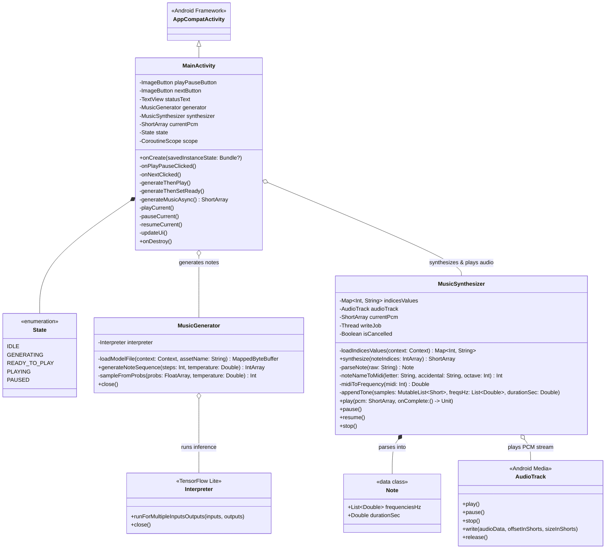
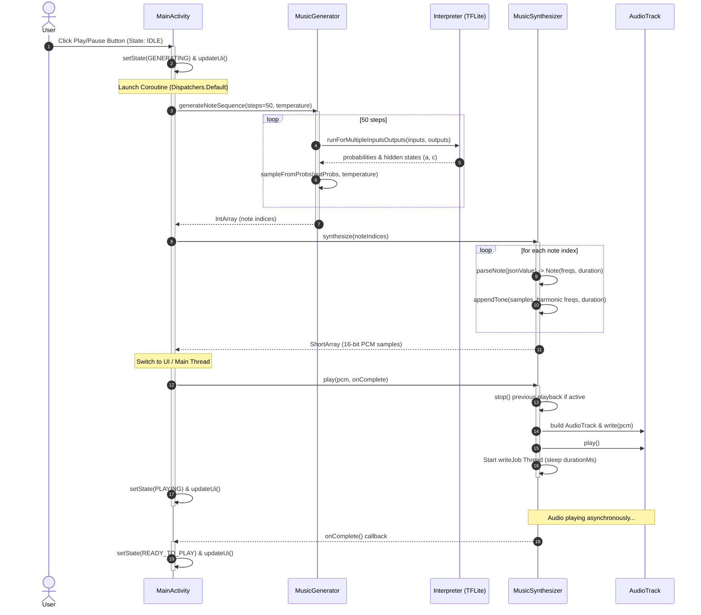
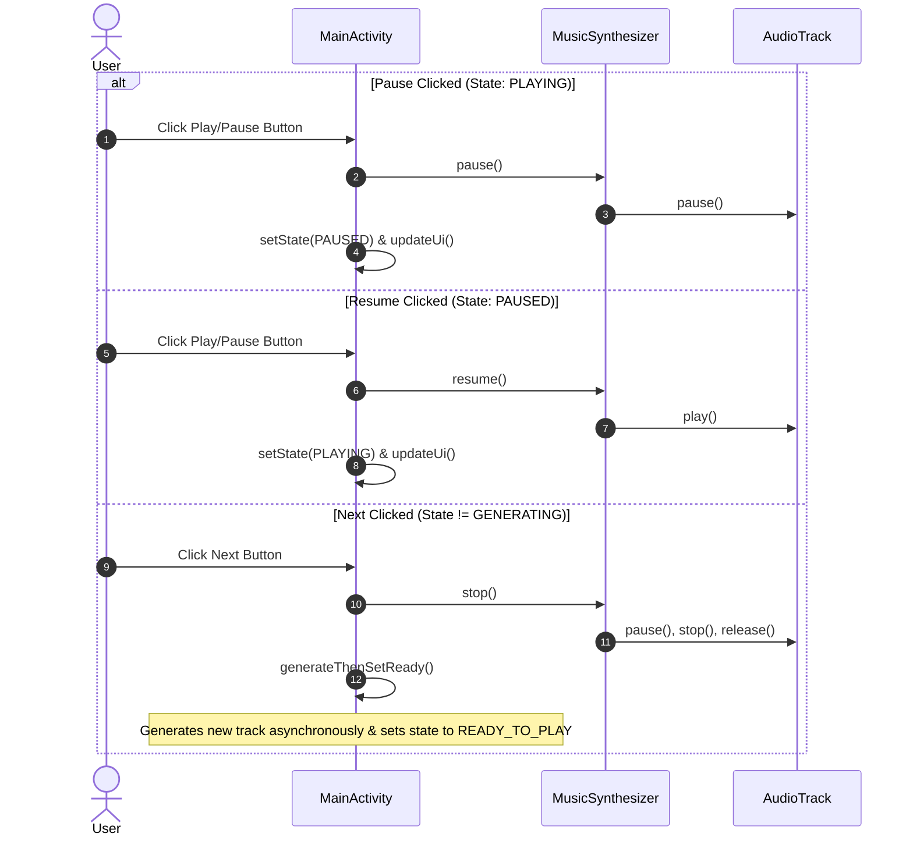

# Project Architecture Diagrams

This document contains the **Class Diagram** and **Sequence Diagrams** for the Jazz TV Android application.

---

## 1. Class Diagram

---

## 2. Sequence Diagrams

### A. Music Generation & Playback Flow (`generateThenPlay`)

### B. Playback Control Flow (Pause / Resume / Next)

---

## 3. Related Code References
- [`MainActivity.kt`](app/src/main/java/com/example/jazztv/MainActivity.kt)
- [`MusicGenerator.kt`](app/src/main/java/com/example/jazztv/MusicGenerator.kt)
- [`MusicSynthesizer.kt`](app/src/main/java/com/example/jazztv/MusicSynthesizer.kt)
